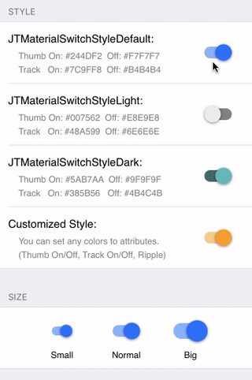
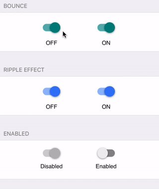

[](http://cocoapods.org/pods/JTMaterialSwitch)
[](http://cocoapods.org/pods/JTMaterialSwitch)
[](http://cocoapods.org/pods/JTMaterialSwitch)

## Overview
`JTMaterialSwitch` is google's material design like switch UI with animation features.

This library has cool and sophisticated animations, ripple effect and bounce effect. Also, customizable properties can be tweaked behaviors and enhance your application UI cool.

With this library, you can easily implement material design switch to your app. 


 
## Installation
`JTMaterialSwitch` is available on CocoaPods.

You can use this library by adding the following command onto your Podfile:

```ruby
pod "JTMaterialSwitch"
```

## Usage

The simplest setup:

```objective-c
  JTMaterialSwitch *switch = [[JTMaterialSwitch alloc] init];
  switch.center = CGPointMake(200, 200);
  [self.view addSubview:switch];
```

This is the simplest and easiest initialization. 
The style, size and initial state of `JTMaterialSwitch` instance is set to all default value as shown below.


In addition, this library also has following designated initializers to set these parameters.

```objective-c
 /**
  *  Initializes a JTMaterialSwitch with a initial switch state position and size.
  *
  *  @param size A JTMaterialSwitchSize enum as this view's size(big, normal, small)
  *  @param state A JTMaterialSwitchState enum as this view's initial switch pos(ON/OFF)
  *
  *  @return A JTMaterialSwitch with size and initial position
  */
 - (id)initWithSize:(JTMaterialSwitchSize)size state:(JTMaterialSwitchState)state;

 /**
  *  Initializes a JTMaterialSwitch with a initial switch size, style and state.
  *
  *  @param size A JTMaterialSwitchSize enum as this view's size(big, normal, small)
  *  @param state A JTMaterialSwitchStyle enum as this view's initial style
  *  @param state A JTMaterialSwitchState enum as this view's initial switch pos(ON/OFF)
  *
  *  @return A JTMaterialSwitch with size, style and initial position
  */
- (id)initWithSize:(JTMaterialSwitchSize)size style:(JTMaterialSwitchStyle)style state:(JTMaterialSwitchState)state;
```

### Customize Behaviors
JTMaterialSwitch has many prateters to customize behaviors as you like.

#### Style and size
- Style: JTMaterialSwitchStyle
 - JTMaterialSwitchStyleLight
 - JTMaterialSwitchStyleDark
 - JTMaterialSwitchStyleDefault

- Size: JTMaterialSwitchSize
 - JTMaterialSwitchSizeBig
 - JTMaterialSwitchSizeNormal
 - JTMaterialSwitchSizeSmall
 
 

 
#### Properties

```objective-c
#pragma State
/** A Boolean value that represents switch's current state(ON/OFF). YES to ON, NO to OFF the switch */
@property (nonatomic) BOOL isOn;
/** A Boolean value that represents switch's interaction mode. YES to set enabled, No to set disabled*/
@property (nonatomic) BOOL isEnabled;
/** A Boolean value whether the bounce animation effect is enabled when state change movement */
@property (nonatomic) BOOL isBounceEnabled;
/** A Boolean value whether the ripple animation effect is enabled or not */
@property (nonatomic) BOOL isRippleEnabled;

#pragma Color
/** An UIColor property to represent the color of the switch thumb when position is ON */
@property (nonatomic, strong) UIColor *thumbOnTintColor;
/** An UIColor property to represent the color of the switch thumb when position is OFF */
@property (nonatomic, strong) UIColor *thumbOffTintColor;
/** An UIColor property to represent the color of the track when position is ON */
@property (nonatomic, strong) UIColor *trackOnTintColor;
/** An UIColor property to represent the color of the track when position is OFF */
@property (nonatomic, strong) UIColor *trackOffTintColor;
/** An UIColor property to represent the color of the switch thumb when position is DISABLED */
@property (nonatomic, strong) UIColor *thumbDisabledTintColor;
/** An UIColor property to represent the color of the track when position is DISABLED */
@property (nonatomic, strong) UIColor *trackDisabledTintColor;
/** An UIColor property to represent the fill color of the ripple only when ripple effect is enabled */
@property (nonatomic, strong) UIColor *rippleFillColor;

```

 

## Change History
1.0.0 Initial Release

## Requirements
iOS 7.0 or later

## Author
Junichi Tsurukawa <j.tsurukawa@gmail.com>

## License
JTFadingInfoView is available under the MIT license.
